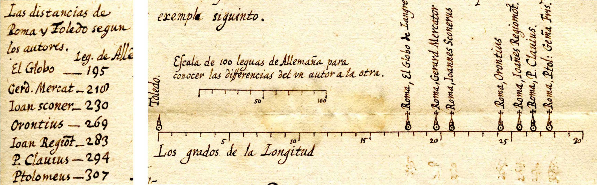
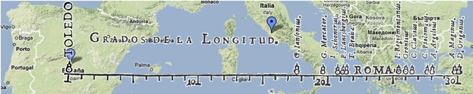
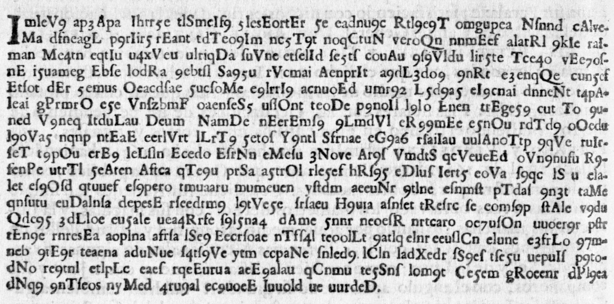
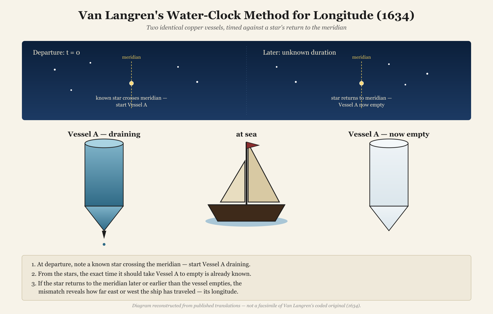

Historians of data visualization live for surprises. Sometimes they're delightful: an unknown fact about a hero of the field, like our discovery of C. J. Minard's burial place in Montparnasse
Cemetery and that his near neighbor there is Andre-Michel Guerry.
I told that story here in *Nightingale* in "Raiders of the Lost Tombs" [@FriendlyChevaliers:2020].

Sometimes these surprises are more unsettling: the discovery that we got some piece of the historical record,
or our interpretation of it, entirely wrong. **Van Langren's Secret**, for an accurate method of determining longitude at sea, is a surprise of this second kind.
Yet telling the story of an unwelcome surprise has its own reward: not just correcting the record, but seeing
how our understanding of history continues to unfold as new "data" are uncovered.
This is one such tale.

## How I Got Here

In December 2008 I received an out-of-the-blue email from Joaquín Ibáñez Ulargui, a materials scientist in Madrid. Going through the papers of an ancestor---fray Íñigo de Brizuela, President of the _Council of Flanders_ in the 1620s---he had found a letter from early 1628, in old Spanish. Its small graph of seven estimates of the longitude difference between Toledo and Rome (@fig-1628-letter) looked very much like the famous 1644 diagram in Michael Florent van Langren's [*La Verdadera Longitud por Mar y Tierra*](https://www.datavis.ca/gallery/langren/LaVerdadera.pdf)---but predated it by at least sixteen years. Was I interested? I was indeed! Graduate students at my university were on strike, so I had plenty of time for a new historical hero.

{#fig-1628-letter}

That email was the seed of a paper Pedro Valero-Mora, Joaquín, and I published in 2010 in *The American Statistician* [@Friendly:2010:langren].
What interested us most was *why* van Langren showed the earlier estimates in what would be the **first graphical display of quantitative data**, a 1D dot plot, rather than the table anyone else at the time would have used. We always ask:

> **What was he thinking?**

Our answer: only a dot plot would let the King **see** that all previous methods[^methods] were so variable as to be useless for navigation at sea.
In the 1644 version, overlaid on a modern map in @fig-1644-overlay, the estimates span over 40% of the distance from Toledo to Rome;
the pin marks the actual distance, $16^{o}\:32'$.

[^methods]: The astronomers' methods were theoretically sound but practically limited: timing **lunar eclipses** or **occultations** (the moon passing in front of a star) from two places---both rare events---or measuring **lunar distances**, the moon's angle to a reference star, which required lunar tables that didn't yet exist. Some estimates came simply from travellers' records. Even Tycho Brahe's, made with the finest pre-telescopic instruments of the age, was badly wrong. That was the point.

{#fig-1644-overlay}

The 1628 letter was a request for patronage, sent to Isabella Clara Eugenia, governor of the Spanish Netherlands. With more salesmanship than science, van Langren argued that longitude determination was a mess, that King Philip IV surely needed it solved for exploration (and plunder!), and that he---descendant of great Dutch globe-makers and mathematician to His Majesty---had found a solution and deserved a reward.

He never said what the answer was. On page 8 of *La Verdadera* he printed it anyway---but in cipher (@fig-cipher-page), promising to reveal the plaintext after suitable compensation. Except for the puzzle, the [text of *La Verdadera*](https://www.datavis.ca/gallery/langren/verdadera.pdf) reads like a modern grant application.
We reproduced the ciphertext in [our supplementary materials](https://www.datavis.ca/gallery/langren/) and moved on---though not before a few retired CIA and NASA codebreakers I tracked down in 2009--10 gave it a real try. Van Langren beat them all.

{#fig-cipher-page width="80%"}

Here are the first six lines, [transcribed exactly from page 8](https://github.com/friendly/vanLangren-Secret/blob/master/cipher-transcription.txt)---a text file of 17 lines of cipher, the thing that stumped everyone, including me:

```{.cipher}
ImIeV9 ap3Apa Ihrr5e tlSmeIf9 5lesEortEr 5e eadnu9c Rtl9e9T omgupea Nſnnd cAlveMa
dfneagL p9rIir5 rEant tdTeo9Im nc5T9t noqCtuN veroQn nnmEef alarRl 9kIe raIman
Me4tn eqtIu u4xV eu ulriqDa ſuVne etſelId ſe5tſ couAu 9ſ9Vldu lir5te Tce4o vEe7oſnE
i5uameg Ebſe lodRa 9ebtſl Sa95u rVcmai AenprIt a9dL3do9 9nRt e3enqQe cun5ef
Etſot dEr 5emus Oeacdſae 5ucſoMe e9lrrI9 acnuoEd umr92 L5d9a5 eI9cnai dnneNt t4pAIeai
gPrmrO e5e VnſzbmF oaenſeS5 uſlOnt teoDe p9noIl l9lo Enen trEge59 cut To 9uned
```

Take a minute and look at it before reading on---this is exactly what stared back at van Langren's readers for 376 years.

I assumed, as I think most people who have written about van Langren did, that his secret had to do with the achievement he's remembered for: [his 1645 lunar map](https://commons.wikimedia.org/wiki/File:Langrenus_map_of_the_Moon_1645.jpg), and the method he built around it---using the sunrise and sunset lines crossing named lunar peaks as a celestial clock. It was a reasonable guess, and it made a good (his)story. It was also wrong.

## The Problem of Longitude

Appreciating what van Langren was hiding requires understanding why **longitude** was so much harder to measure than **latitude** in the _Age of Discovery_, when European kings sent ships across the world to find new trading routes, treasure, and lands.

**Latitude** is easy: the elevation of the sun or a star above the horizon tells you directly how far north or south of the equator you are. Nature provides the reference frame.

**Longitude** offers no such anchor. There is no natural zero line, and a degree of longitude shrinks from 111 km at the equator to zero at the poles. What *is* fixed is its relationship to time: Earth rotates 15° per hour, so a difference in longitude is a difference in local time. The solution therefore requires **two clocks**: one keeping local time, reset each day at solar noon, and one keeping the time at a reference location, set before departure and never touched again:

$$\Delta\text{longitude} = 15° \times \Delta\text{time} = 15° \times (\text{time}_\text{Here} - \text{time}_\text{There})$$

No mechanical clock of the era could keep that reference time aboard a ship for weeks. The alternative was *astronomical*: use a predictable celestial event---a lunar eclipse, an occultation, the moons of Jupiter---as a surrogate reference clock, timing it locally and comparing with the time predicted at home.

That was the kind of answer everyone, including me, expected van Langren's cipher to hold.

## The Cipher Falls

Eleven years after our paper---long enough that I had filed the cryptogram away as a loose end nobody would ever tie off---I learned that it had been solved. Not by a historian of science, but by a Belgian warehouse worker and amateur cryptographer. Other amateurs had kept it alive: the cryptology blogger Klaus Schmeh flagged it in 2015, and the mathematician [Dirk Huylebrouck](https://dirkhuylebrouck.be/) spent years shopping it around online forums. Then, in December 2020, Jarl Van Eycke, with David Oranchak and Sam Blake, cracked the [Zodiac Killer's Z340 cipher](https://arxiv.org/pdf/2403.17350),[^zodiac] unsolved for 51 years. Huylebrouck tracked down Van Eycke and handed him the _van Langren Code_. He solved it in about a week!

[^zodiac]: The Zodiac Killer murdered at least five people in the San Francisco Bay Area in 1968--1969, taunting police with ciphers mailed to newspapers.

Van Eycke never published his own account of the break; what follows retraces his steps as [Klaus Schmeh reported them](https://scienceblogs.de/klausis-krypto-kolumne/jarl-van-eycke-solves-400-year-old-longitude-message/) from Van Eycke's email, applied to the ciphertext from our 2010 supplementary materials. It's a small master class in breaking a cipher with no known key and no certainty about what kind of cipher it even is.

### Step 1: the "words" are a decoy

```{r word-lengths}
#| echo: false
#| results: hide
cipher_raw <- readLines("cipher-transcription.txt", encoding = "UTF-8") |>
  paste(collapse = " ")
tokens <- strsplit(cipher_raw, "[ \t]+")[[1]]
tokens <- tokens[tokens != ""]
```

`r length(tokens)` "words," and the lengths cluster almost entirely between 4 and 8 characters---you can see it in the "rivers" of spaces running down the lines. In French prose (the plaintext language, as it turns out), roughly 30% of words are 1--2 letters---*de*, *en*, *le*, *il*, the connective tissue of any sentence. In the cipher, barely 3% are that short. The spacing is decorative and purposely deceptive, not linguistic.

| Length | English | French | Spanish | German | Langren  |
|--------|--------:|-------:|--------:|-------:|---------:|
| 1–2    | 25      | 30     | 25      | 20     | [**3**]{style="color:red"}    |
| 3–5    | 40      | 38     | 40      | 32     | 41                            |
| 6–9    | 28      | 24     | 27      | 35     | [**55**]{style="color:red"}   |
| 10+    | 7       | 8      | 8       | 13     | [**\<1**]{style="color:red"}  |

: Approximate word-length distributions (% of tokens), European languages vs. van Langren's cipher.

### Step 2: strip spaces and decoy capitals

```{r strip-capitals}
#| echo: false
#| results: hide
nospace <- gsub("[ \t]+", "", cipher_raw)
nocaps <- gsub("[A-Z]", "", nospace)
```

With the spaces gone, Van Eycke first tested for [periodic transposition](https://en.wikipedia.org/wiki/Transposition_cipher)---letters simply reordered rather than substituted. Nothing. He then tried removing different classes of symbols to see what improved the letter-trigram statistics.[^trigram] The capital letters sprinkled through the text turned out to be pure noise, meant to further deceive any rival who might try to steal van Langren's thunder.[^other-ciphers]
Deleting them leaves a single unbroken run of `r nchar(nocaps)` lowercase letters, long-s (ſ) characters, and digits.

[^trigram]: Letter-trigram statistics measure the frequency of overlapping three-letter sequences in a language (e.g., "the," "and"). Analysts use them as a "fitness score": the closer a proposed decryption comes to the trigram frequencies of a real language, the more likely it is correct.

[^other-ciphers]: Hiding a priority claim in a cipher was not unique to van Langren. Galileo registered his 1610 observation of Saturn's odd shape (the rings) as a Latin anagram, *"I have observed the highest planet three-formed"*; Robert Hooke published his law of elasticity in 1676 as *ceiiinosssttu*, later decoded as *ut tensio, sic vis*. Each held the date of discovery in escrow without giving anything away.

### Step 3: split into three interleaved streams

```{r three-streams}
#| echo: false
#| results: hide
chars <- strsplit(nocaps, "")[[1]]
n <- length(chars)
stream1 <- paste(chars[seq(1, n, by = 3)], collapse = "")
stream2 <- paste(chars[seq(2, n, by = 3)], collapse = "")
stream3 <- paste(chars[seq(3, n, by = 3)], collapse = "")
```

Reading the run at different intervals, Van Eycke found that taking every third character---positions 1, 4, 7, ...---suddenly produced fragments of real words. The plaintext had been split across three interleaved streams.

### Step 4: undo the digit substitution

The last layer is a simple key: 1 = a, 2 = b, ... 9 = i. Concatenating the three streams in order and substituting resolves the whole thing into continuous prose---not in the Spanish that both van Langren's introduction and our own paper had led everyone to expect, but seventeenth-century French. _Quelle surprise!_

```{r digit-substitution}
#| echo: false
plain_raw <- paste0(stream1, stream2, stream3)
digit_map <- setNames(letters[1:9], as.character(1:9))
plain_chars <- strsplit(plain_raw, "")[[1]]
subbed <- vapply(plain_chars, function(ch) {
  if (ch %in% names(digit_map)) digit_map[[ch]] else ch
}, character(1))
plain_final <- gsub("ſ", "s", paste(subbed, collapse = ""))
```

Here is the passage that describes his method:

```{r highlight-excerpt}
#| echo: false
#| results: asis
# text to highlight
excerpt <- substr(plain_final, 533, 940)
target  <- "langrendictqvonfairadeuxuisesdecuiuredesemblablecipaciteenformedecelindre"

width  <- 68
n      <- nchar(excerpt)
starts <- seq(1, n, by = width)
tpos   <- regexpr(target, excerpt, fixed = TRUE)
ts     <- as.integer(tpos)          # -1 if not found
te     <- if (ts > 0L) ts + nchar(target) - 1L else -1L

esc <- function(x)
  x |> gsub("&", "&amp;", x = _, fixed = TRUE) |>
       gsub("<", "&lt;", x = _, fixed = TRUE) |>
       gsub(">", "&gt;", x = _, fixed = TRUE)

# split each line into (before, highlighted, after) pieces
segs <- lapply(starts, function(ls) {
  le  <- min(ls + width - 1L, n)
  txt <- substr(excerpt, ls, le)
  os  <- max(ls, ts);  oe <- min(le, te)
  if (ts > 0L && os <= oe) {
    is <- os - ls + 1L;  ie <- oe - ls + 1L
    c(substr(txt, 1L, is - 1L), substr(txt, is, ie), substr(txt, ie + 1L, nchar(txt)))
  } else {
    c(txt, "", "")
  }
})

if (knitr::pandoc_to("docx")) {
  # Word drops raw HTML, so emit an OpenXML paragraph with a yellow highlight
  run <- function(x, hl = FALSE) {
    if (!nzchar(x)) return("")
    paste0('<w:r><w:rPr><w:rStyle w:val="VerbatimChar"/>',
           if (hl) '<w:highlight w:val="yellow"/>',
           '<w:sz w:val="18"/><w:szCs w:val="18"/></w:rPr>',
           '<w:t xml:space="preserve">', esc(x), '</w:t></w:r>')
  }
  lines_xml <- vapply(segs, function(s)
    paste0(run(s[1]), run(s[2], TRUE), run(s[3])), character(1))
  cat('```{=openxml}\n<w:p><w:pPr><w:pStyle w:val="SourceCode"/></w:pPr>',
      paste(lines_xml, collapse = '<w:r><w:br/></w:r>'), '</w:p>\n```\n', sep = "")
} else {
  lines_html <- vapply(segs, function(s)
    paste0(esc(s[1]), if (nzchar(s[2])) paste0("<mark>", esc(s[2]), "</mark>"),
           esc(s[3])), character(1))
  cat('<pre style="background:#f8f8f8;padding:0.6em;border-radius:4px;font-size:0.85em;">\n',
      paste(lines_html, collapse = "\n"), '\n</pre>\n', sep = "")
}
```

Even with the word breaks missing and a rough patch or two (likely a transcription slip in our 2010 `cipher.txt`), real seventeenth-century French is unmistakably there: *estoilles* (stars), *meridon* [méridien], and then---right on cue---

| | |
|:---|:---|
| **French** | *...florenc[ius] ouan langren dict qu'on faira deux uises de cuiure de semblable c[a]pacite en forme de celindre...* |
| **English** | "Florentius van Langren says one shall make two vessels of copper of similar capacity in the form of a cylinder." |

: {tbl-colwidths="[15,85]"}

The full R code reproducing all four steps is in [`R/decode-cipher.R`](https://github.com/friendly/vanLangren-Secret/blob/master/R/decode-cipher.R).[^code]

[^code]: All the R code for this article is in its GitHub repository, <https://github.com/friendly/vanLangren-Secret>. More detailed descriptions of the R code used in these analyses are in the original blog post, <https://friendly.github.io/blog/posts/2026-07-van-langren/>.

## What van Langren Was Hiding

The plaintext describes not a lunar method at all, but a **24-hour water clock** (@fig-waterclock). In paraphrase:

> Make two cylindrical copper vessels of equal capacity, each ending in a cone with a small hole at its point, and fill them with seawater. At departure, start the first draining while noting which known star sits on the meridian; it will run empty in exactly 24 hours of sidereal time, when that star returns to the meridian. Then start the second, and so on, every day of the voyage. Each time a vessel empties, the reference star's distance from the meridian gives the degrees of longitude traveled from port. A small cork float marks the moment of emptying.

It's a genuinely clever idea: the water clock carries the time of the home port, and the stars supply the local time to compare it with---exactly the two clocks the longitude problem requires. But it is built on the oldest timekeeping technology available to him, and that, I think, is exactly why nobody guessed it. Van Langren is remembered---by me among others---for looking *up*, at the moon.

::: {custom-style="PullQuote"}
It turned out that his "secret" had him looking at a copper cone and a dripping hole, a technology already two thousand years old when he was born.
:::

{#fig-waterclock width="80%"}

::: {style="float: right; margin: 0 0 1em 1.5em; width: 30%;"}
.](images/Harrison-H1_low_250.jpg){#fig-harrison}
:::

The [clepsydra](https://en.wikipedia.org/wiki/Clepsydra) is one of humanity's oldest timekeeping instruments, and its flaw was ancient too: water's flow rate shifts with temperature, as the Han-dynasty astronomer [Huan Tan](https://en.wikipedia.org/wiki/Huan_Tan) noted two thousand years before van Langren. At sea, pitching decks and swinging temperatures would have thrown his copper cones out of sync within days, and the tolerance was brutal: four minutes of drift is one degree of longitude---about 68 km at the latitude of Amsterdam.

Van Langren wrote his cipher in the early 1640s. The pendulum clock was still some fifteen years off; an accurate [marine chronometer](https://www.rmg.co.uk/stories/time/harrisons-clocks-longitude-problem) (@fig-harrison), more than a century. He was reaching for the best tool of his moment to solve a problem no tool of his era could actually solve.

## Bonus: Reproducing Langren's 1644 Graph

Reproducing a historical graph with modern tools is not just technical imitation.
In my paper ["A Brief History of Data Visualization"](https://www.datavis.ca/papers/hbook.pdf)
[@Friendly:2006:hbook] I describe an approach I call **understanding through reproduction**
(or *re-visioning*): remaking a historical graph
from the ground up---with current data and software---as a way of answering the historian's
perennial question, *what was he thinking?* 

The attempt to reproduce forces you to make the
choices the original maker faced: what to show, how to encode it, what to leave out.
Those choices, and the difficulty of getting them right, reveal the intellectual and
graphical constraints of the time. The method can reveal hidden insights, help
to appreciate the historical ingenuity and sheer brilliance of hand-drawn graphics and reveal design flaws, such as distorted scales.

For van Langren's 1D dot plot the exercise is particularly instructive. The graph had no
precedent---he was inventing a form, not following one. Try to re-create it and you realize
almost immediately why a table of twelve longitude values would not have made his point: a
column of numbers, however sorted, tells you nothing at a glance about their spread.

Only when you place them on a common scale does the argument become visible---the estimates
are scattered across nearly the entire plausible range, and *that* is precisely van Langren's case to
the King.

My first goal was to reproduce something like @fig-1644-overlay: van Langren's estimates overlaid on a modern map. The data are in `HistData::Langren1644`, which also provides the Google map image used as a backdrop. Rebuilding it takes three layers, each written as its own function: (1) the map itself; (2) city markers for Toledo and Rome; and (3) the dot plot on top---the same trick I use elsewhere in `HistData` to re-vision
[John Snow's Cholera dot plot](https://friendly.github.io/HistData/reference/Snow.html)
and [Minard's March on Moscow graphic](https://friendly.github.io/HistData/reference/Minard.html).
The script is [`R/reproduce-langren-overlay.R`](https://github.com/friendly/vanLangren-Secret/blob/master/R/reproduce-langren-overlay.R).

### "I did that better by hand!"

A map overlay answers the *argument* well enough. But re-visioning in the deeper
sense means trying to reproduce the *artifact*---the spare white strip, the figure-8
snowman markers, the italic lettering. Imagine showing van Langren the map overlay;
he studies it for a moment and turns up his nose and says: 

> *"I did that better by hand!"*

He has a point. Each of his snowman markers was hand-engraved on a copper plate; each name
individually scratched in by the engraver. The uniformity `ggplot2` achieves in milliseconds would have taken hours of skilled
labour in 1644. So: how close can we get?

![Van Langren's original 1644 graph, from *La Verdadera Longitud por Mar y Tierra*, p. [2]. _Source_: Courtesy of The Newberry Library, Chicago. Ayer folio QB225 .L36 1644.](images/Langren1644-Newberry-bw.png){#fig-1644-original}

The reproduction uses a handful of `ggplot2` techniques worth noting:

- **Period font**: the `showtext` package loads *IM Fell English* from Google Fonts,
  a typeface digitised from the Fell collection donated to Oxford University Press in
  1686---forty-two years after *La Verdadera* was printed, but as close in spirit as
  a free font gets.

  <!--
  ```r
  font_add_google("IM Fell English", "imfell")
  showtext_auto()
  ```
  -->


- **Arbitrary geometry via `annotate()`**: the axis line, minor tick marks, and major
  ticks are plain `"segment"` annotations rather than the usual ggplot2 axis machinery,
  which gives exact control over length and position. Fixed text labels---*TOLEDO.*,
  *ROMA*, *Grados de la Longitud.*---are placed the same way, with `hjust`, `vjust`,
  and `angle` set individually.

  <!--
  ```r
  annotate("segment", x = 0, xend = 32, y = 0, yend = 0, linewidth = 0.6) +
  annotate("text", x = c(10, 20, 30), y = -0.6,
    label = c("10.", "20.", "30."), family = "imfell", size = 4.2)
  ```
  -->


- **Snowman markers**: van Langren's figure-8 data symbols are approximated by two
  stacked `geom_point()` calls, one per astronomer---a filled body circle sitting on
  the axis and a smaller hollow head circle above it. `coord_fixed(ratio = 1)` locks
  the x and y scales to the same physical size so the circles stay round and the
  overall strip proportions match the original's roughly 5:1 width-to-height ratio.

  <!--
  ```r
  geom_point(aes(y = body_y), shape = 21, size = body_size, fill = "black") +
  geom_point(aes(y = head_y), shape = 21, size = head_size, fill = "white")
  ```
  -->


The full reconstruction---axis, labels, markers, and all---is about fifty lines; the
complete, runnable code is in [`R/reproduce-langren-graph.R`](https://github.com/friendly/vanLangren-Secret/blob/master/R/reproduce-langren-graph.R). Putting it together (@fig-reconstruction):

```{r fig-reconstruction}
#| echo: false
#| fig-cap: "A ggplot2 reconstruction of van Langren's 1644 graph."
#| fig-width: 7
#| fig-asp: !expr 7.5 / 35
library(ggplot2)
library(showtext)
library(HistData)
data(Langren1644)

font_add_google("IM Fell English", "imfell")
showtext_opts(dpi = 96)   # match Quarto HTML default
showtext_auto()

roma_x    <- 23.5          # van Langren's placement
true_long <- 16 + 32/60    # true distance, unknown at the time
body_size <- 4.0;  head_size <- 2.5
body_y    <- 0.50; head_y    <- 0.80

ggplot(Langren1644, aes(x = Longitude)) +
  annotate("segment", x = 0, xend = 32, y = 0, yend = 0, linewidth = 0.6) +
  annotate("segment",
    x = seq(0, 32, 1), xend = seq(0, 32, 1),
    y = 0, yend = -0.15, linewidth = 0.3) +
  annotate("segment",
    x = c(10, 20, 30), xend = c(10, 20, 30),
    y = 0, yend = -0.35, linewidth = 0.6) +
  annotate("text",
    x = c(10, 20, 30), y = -0.6,
    label = c("10.", "20.", "30."), family = "imfell", size = 4.2) +
  geom_point(aes(y = body_y),
    shape = 21, size = body_size, fill = "black", color = "black", stroke = 0.8) +
  geom_point(aes(y = head_y),
    shape = 21, size = head_size, fill = "white", color = "black", stroke = 0.8) +
  annotate("point", x = 0, y = body_y,
    shape = 21, size = body_size, fill = "black", color = "black", stroke = 0.8) +
  annotate("point", x = 0, y = head_y,
    shape = 21, size = head_size, fill = "white", color = "black", stroke = 1.0) +
  geom_text(aes(y = head_y + 0.35, label = paste0(Name, ".")),
    angle = 90, hjust = 0, vjust = 0.5,
    family = "imfell", size = 4.8, fontface = "italic") +
  annotate("text", x = -0.8, y = 3.5,
    label = "TOLEDO.", angle = 90, family = "imfell", size = 6.0, fontface = "bold") +
  annotate("text", x = roma_x, y = 0,
    label = "ROMA", family = "imfell", size = 6.0, fontface = "bold", vjust = 2.0) +
  annotate("text", x = 6, y = 2.8,
    label = "Grados de la Longitud.",
    family = "imfell", size = 10, hjust = 0, fontface = "italic") +
  # arrow below the axis marking the true distance (16°32'), unknown to van Langren
  annotate("segment",
    x = true_long, xend = true_long, y = -0.9, yend = -0.4,
    arrow = arrow(length = unit(0.15, "cm"), type = "open"),
    linewidth = 0.5) +
  coord_fixed(ratio = 1, xlim = c(-2, 33), ylim = c(-1.0, 6.5), expand = FALSE) +
  theme_void()
```

Van Langren would still turn up his nose---the font is only a close cousin of his
printer's type, and his snowman markers were hand-punched where ours are computed
circles. Moreover, if I showed him the `ggplot2` code, he might say, "What a lot
of trouble to do what I did lovingly by hand." 
He's got a point: the 80/20 rule (or [Pareto Principle](https://en.wikipedia.org/wiki/Pareto_principle)) for data graphics says
that you can achieve 80% of your graphic design with 20% of the work, but
it takes the remaining 80% of work to perfect it.

Nevertheless the argument the graph was built to make comes through regardless: twelve
authorities, strung across more than fifteen degrees, and not one of them close to the
true answer of 16°32'.

## Every Cipher Tells a Story

We opened the 2010 paper with an epigraph borrowed, a little irreverently, from Rod Stewart: *every picture tells a story*. So, it turns out, does every cipher, and this one told two.

The first is about van Langren himself: a man who understood the longitude problem well enough to devise a plausible solution, but whose copper cones could never have held time steady on a heaving ship. His idea was neither naive nor foolish, and hiding it in "dark letters" was a brilliant piece of grantsmanship. He is remembered instead for what he didn't encrypt: the graph that made the *problem* visible, and his 1645 map of the moon, where the crater _Langrenus_ still bears his name.

The second is about time and what we can know. The cipher sat unread for 376 years, and our lunar interpretation of it sat unchallenged for a decade: reasonable given what we could read, and wrong. It took a chain of amateurs and one extraordinary codebreaker to set it right. History is not static; the answer to the historian's question---*what was he thinking?*---can change whenever new evidence turns up. Here it turned out to be: something clever, impractical, and beautifully encrypted.

::: {custom-style="PullQuote"}
The shock of finding our interpretation wrong is replaced, in the end, by a feeling of satisfaction in being able to right the ship of history.
:::

::: {.content-visible when-format="html"}
## Editorial Check: Word Count

A running check against Nightingale's 2,000--2,500 word target for the *History & Context* column---counting the prose separately from the R code chunks, since only the prose counts against the page budget.

```{r word-count}
#| echo: false
qmd_lines <- readLines("vanLangren-Secret.qmd", warn = FALSE)

# drop the YAML frontmatter
yaml_marks <- which(qmd_lines == "---")
body <- qmd_lines[-(yaml_marks[1]:yaml_marks[2])]

# flag lines inside fenced code chunks (```{...} ... ```)
fence <- grepl("^```", body)
in_chunk <- logical(length(body))
open <- FALSE
for (i in seq_along(body)) {
  if (fence[i]) {
    in_chunk[i] <- TRUE
    open <- !open
  } else {
    in_chunk[i] <- open
  }
}

count_words <- function(x) {
  x <- paste(x, collapse = " ")
  x <- gsub("[`*_#>|\\[\\]\\(\\)!-]", " ", x)
  words <- strsplit(trimws(x), "\\s+")[[1]]
  sum(nzchar(words))
}

data.frame(
  measure = c("Prose only", "Prose + code"),
  words   = c(count_words(body[!in_chunk]), count_words(body))
)
```
:::
